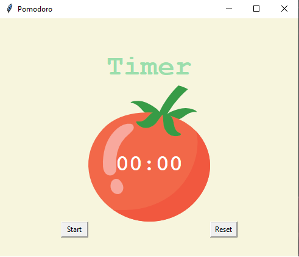

# Pomodoro Timer ⏱🍅

A simple Pomodoro Timer built using Python and Tkinter, following the Angela Yu course.

This app visually guides users through 25-minute work sessions followed by short and long breaks using a countdown and a tomato-themed UI.

**Purpose:** Tkinter consolidation — GUI design, timer logic, and countdown mechanism.

---

## 🖼 Preview

---

## 🛠 Features
- 25-minute work sessions
- 5-minute short breaks
- 20-minute long breaks every 4 work sessions
- Automatic countdown and reset
- Visual checkmarks for completed sessions

---

## 📁 How to Run

1. Make sure you have Python installed.
2. Save the image `tomato.png` in the same folder as the script.
3. Run the script

## 📚 What I Learned

- How to build a basic UI using Tkinter (Canvas, Labels, Buttons)
- How to use the `.after()` method to create a countdown timer
- Managing state across function calls using a global counter (`reps`)
- Resetting and updating the GUI dynamically
- Grid layout usage vs other layout managers
